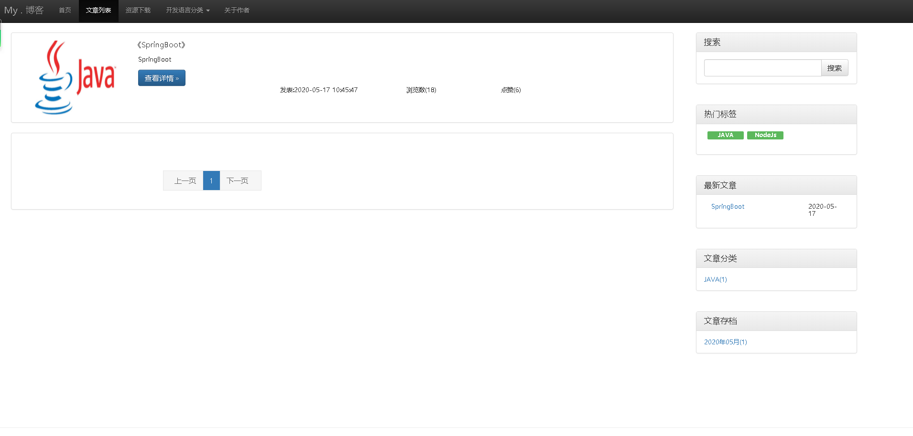
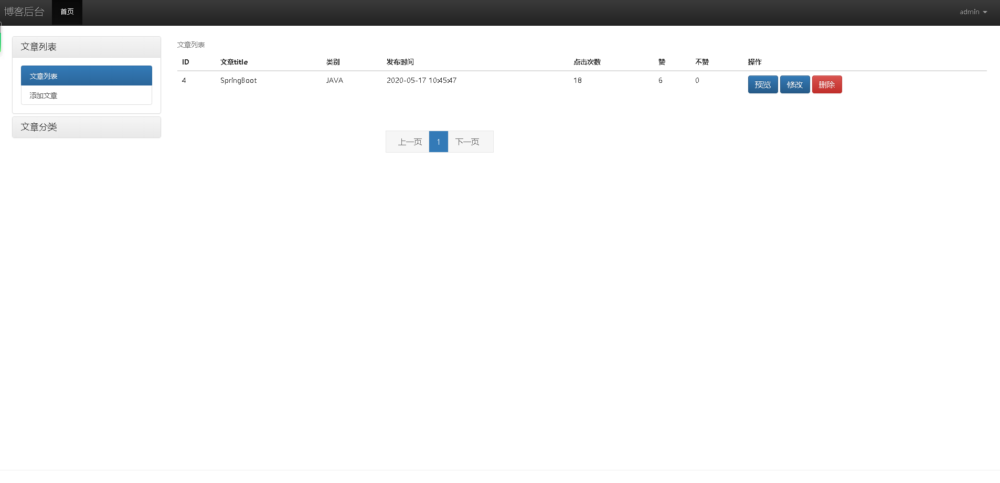

### 这是一个基于nodejs + express + mysql 的博客,为了熟悉nodejs

### 运行方法 

* 修改config目录下的db.js,修改为自己的mysql数据库连接

* 安装nodejs环境, 验证:node -v

* 运行项目 进入blog目录下面 node ./bin/www 即可运行项目

* 访问 默认端口是3000，前台访问localhost:3000 ,后台localhost:3000/admin  ,账号:admin 密码:admin

### 运行结果展示

* 前台界面

  
  
* 后台界面

    

  

